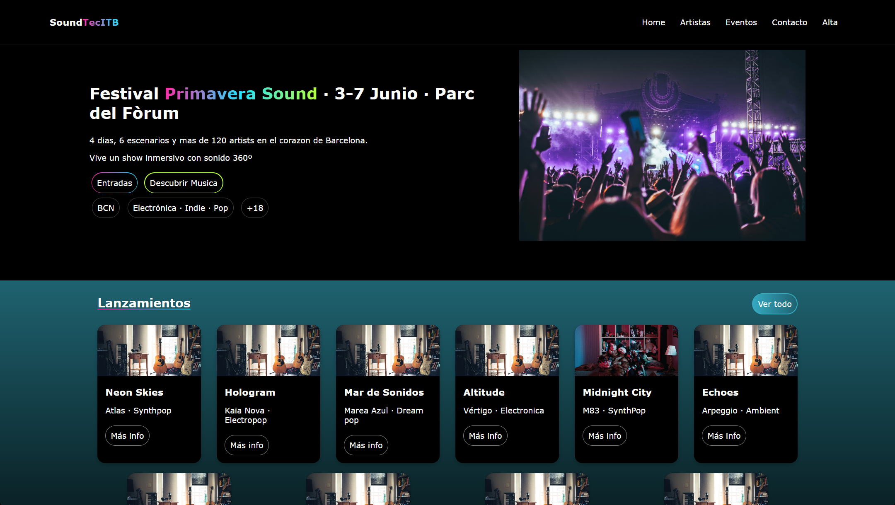
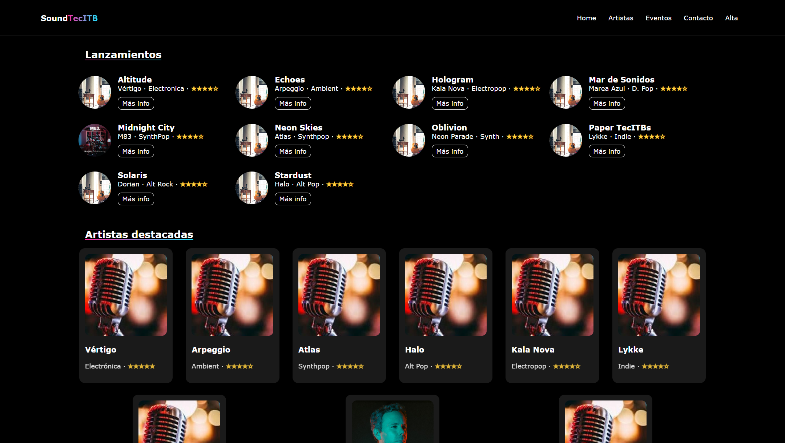
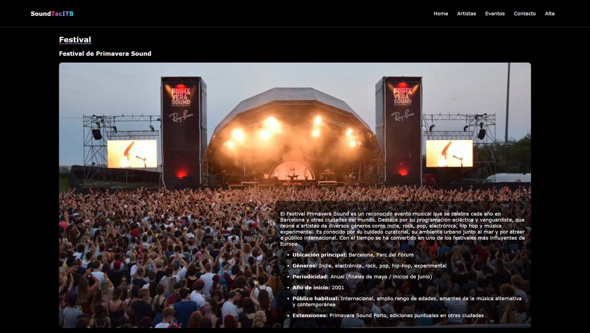
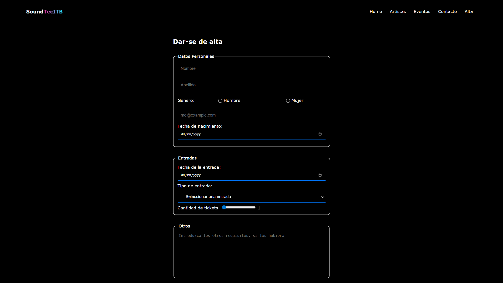

# Pr02_ZhangYu

## Página web

### 1. [index.html](index.html)

Aquí es donde mostrará la página principal sobre el festival y también los lanzamientos, las artistas, etc. Mediante los botones "Más info" o haciendo clic en las cartas, se podrá ver en detalle las informaciones de cada lanzamiento, artista y festivales (solo hay uno de cada). Y, mediante dos botones, que serán "Ver todo" y "Ver ranking", se podrá acceder a la página de listados. También tendrá una barra de navegación con el logo del sitio para ir a determinadas páginas y secciones, que se verá en todas las páginas.

### 2. [festivales.html](festivales.html)

Aquí se verá un listado de lanzamientos y de las artistas destacadas. Mediante los botones "Más info" o haciendo clic en las cartas, se podrá ver en detalle las informaciones de cada lanzamiento, artista y festivales (solo hay uno de cada).

### 3. [detalle.html](detalle.html)

Esta página es donde se verán los detalles de cada festival, lanzamientos y artistas (solo hay uno de cada).

### 4. [alta.html](alta.html)

Esta será la última página, donde hay dos formularios, uno para darse de alta y otro para contactarnos. En cada formulario se piden los datos personales como el nombre y apellido, el correo electrónico, etc., y específicamente, según el tipo de formulario, se piden algunos datos en concreto; por ejemplo, en el formulario de darse de alta, también se piden la fecha de la entrada que el usuario quiere comprar, la cantidad de entradas, etc.

## Retrospectiva

En esta práctica, he aprendido mucho, por ejemplo, cambiar la longitud y la altura de una imagen sin cambiar la dimensión, o también definir los espacios entre cada elemento si el display es flex o grid, etc.

En conclusión, esta práctica ha sido divertida e interesante, ya que hay estilos de algunos elementos que lo he hecho bastante básica. Pero en general, me ha ido bien.
